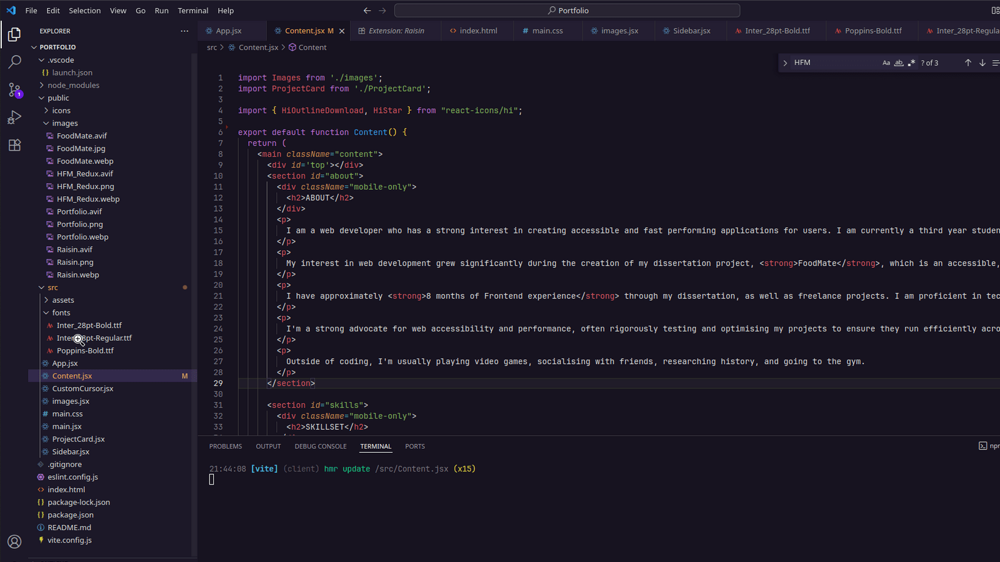

# Raisin 

Raisin is a Visual Studio Code dark theme that I personally created for myself in order to both reduce screen glare whilst also being very visually appealing. 

## Raisin Theme

## Installation

1. Install Visual Studio Code
2. Launch Visual Studio Code
3. Choose Extensions from the menu
4. Search for Raisin
5. Click <b>Install</b> to install it
6. Click Reload to reload the code
7. From the search bar, search: >Preferences: Color Theme, and then select <b>Raisin</b>.

## Misc

I am still getting to grips with creating themes, so don't be shy to file an issue! Suggestions are also very welcome!
